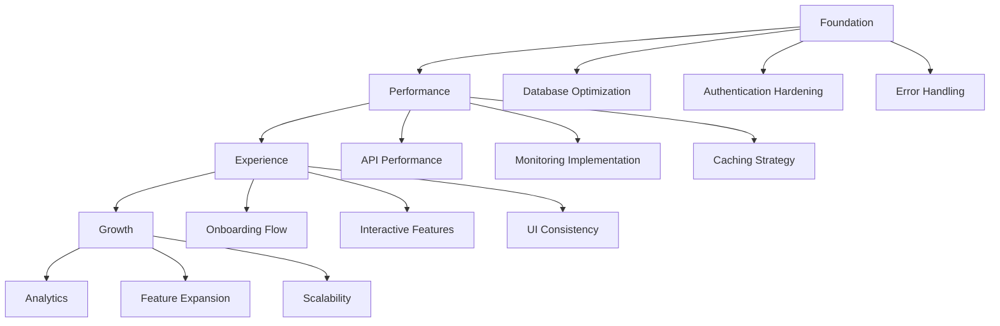
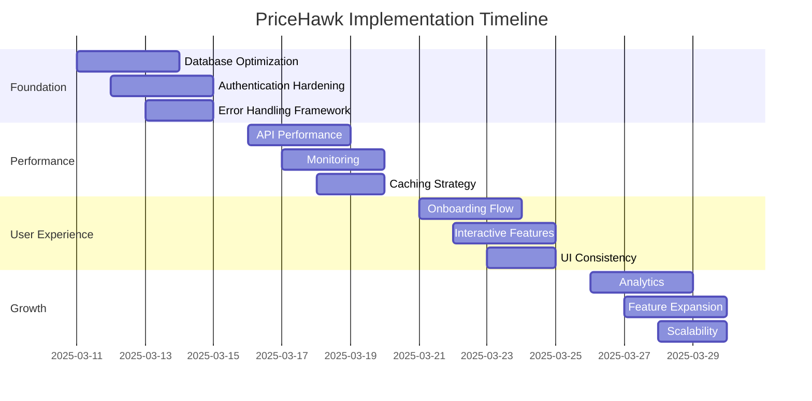

# PriceHawk: Advanced Implementation Strategy

## Executive Summary

After thorough analysis of PriceHawk's current state, this document outlines a structured approach to completing the project's migration to production while enhancing user experience and system performance. The strategy follows a foundation-first approach where each phase builds upon a more stable system, prioritizing critical infrastructure improvements before user-facing enhancements.

## Strategic Implementation Phases

## Phase 1: System Foundation (1 week)

### Database Optimization

1. **Strategic Indexing Implementation**
   - Add composite indexes on `price_history` table for `(productId, timestamp)` to optimize time-series queries
   - Implement indexes on `alerts` table for `(userId, status)` to improve filtered alert views
   - Create indexes on frequently queried fields in the `products` table
   - Consider time-based partitioning for `price_history` if volume becomes significant

2. **PostgreSQL-Specific Optimizations**
   - Implement prepared statements throughout Prisma client usage
   - Configure proper connection pooling settings
   - Optimize text fields by using appropriate VARCHAR lengths
   - Ensure proper CASCADE rules for referential integrity

3. **Implementation Tasks**
   - Create a Prisma migration to add the necessary indexes
   - Modify the Prisma client configuration for optimized connection handling
   - Update repository methods to utilize prepared statements where appropriate
   - Implement query optimization for common data access patterns

### Authentication System Hardening

1. **JWT Error Resolution**
   - Enhance JWT wrapper with pre-flight validation to prevent null payload errors
   - Implement token refresh mechanism to proactively refresh tokens
   - Add redundant session validation methods not solely reliant on JWT

2. **Security Enhancements**
   - Implement rate limiting middleware for authentication endpoints
   - Add CSRF protection for authentication forms
   - Enhance password policies with complexity requirements
   - Implement progressive delays for failed login attempts

3. **Implementation Tasks**
   - Upgrade JWT wrapper with robust error handling
   - Create middleware for rate limiting and CSRF protection
   - Enhance NextAuth configuration with security best practices
   - Add server-side validation for all authentication processes

### Error Handling Framework

1. **Unified Error Handling**
   - Implement centralized error handling for API routes
   - Create standardized error response format
   - Add detailed error logging with severity levels
   - Implement global error boundary components

2. **Resilience Patterns**
   - Add retry logic with exponential backoff for transient errors
   - Implement circuit breaker pattern for external dependencies
   - Create fallback mechanisms for critical functionality

3. **Implementation Tasks**
   - Create ErrorService for standardized error processing
   - Implement API middleware for consistent error responses
   - Add client-side error boundary components with fallback UI
   - Set up error logging infrastructure

## Phase 2: Performance Optimization (1 week)

### API Performance Enhancements

1. **Request/Response Optimization**
   - Implement response compression
   - Add fields filtering to reduce payload size
   - Optimize serialization/deserialization processes
   - Implement pagination for all list endpoints

2. **Server-Side Processing**
   - Move complex calculations to background tasks
   - Optimize database query patterns
   - Implement batch processing for bulk operations
   - Use streams for large data transfers

3. **Implementation Tasks**
   - Add compression middleware to API routes
   - Update repository methods to support field selection
   - Implement pagination helpers for list endpoints
   - Create background processing infrastructure

### Monitoring Implementation

1. **System Metrics**
   - Implement API response time tracking
   - Add database query performance monitoring
   - Track memory and CPU usage
   - Monitor external service dependencies

2. **Business Metrics**
   - Track user engagement statistics
   - Monitor subscription conversion rates
   - Measure product tracking activity
   - Analyze alert effectiveness

3. **Implementation Tasks**
   - Implement middleware for API performance tracking
   - Create admin dashboard for system monitoring
   - Set up alerts for critical system issues
   - Establish baseline performance metrics

### Caching Strategy

1. **Multi-Level Caching**
   - Implement browser caching for static assets
   - Add API response caching for read-heavy endpoints
   - Implement database query result caching
   - Consider Redis for shared caching in production

2. **Cache Invalidation**
   - Implement precise invalidation strategies
   - Add cache versioning for controlled updates
   - Create cache warming for frequently accessed data

3. **Implementation Tasks**
   - Add caching headers to static asset responses
   - Implement API response caching middleware
   - Create cache manager service for centralized control
   - Add cache debugging tools for development

## Phase 3: User Experience Enhancement (1 week)

### Onboarding Flow

1. **First-Time User Experience**
   - Create guided welcome tour
   - Implement step-by-step product tracking wizard
   - Add contextual help throughout the interface
   - Create interactive feature demonstrations

2. **Product Addition Experience**
   - Simplify URL input process
   - Add visual feedback during scraping
   - Implement suggested retailers
   - Create bulk import capability

3. **Implementation Tasks**
   - Design and implement onboarding UI components
   - Create tour overlay system
   - Add contextual help tooltips
   - Enhance URL input form with validation and suggestions

### Interactive Features

1. **Price History Visualization**
   - Enhance charts with zoom/pan capabilities
   - Add price comparison across retailers
   - Implement trend analysis visualization
   - Create interactive price drop notifications

2. **Dashboard Enhancements**
   - Add savings calculations and visualizations
   - Implement personalized product recommendations
   - Create quick action shortcuts for common tasks
   - Add drag-and-drop organization

3. **Implementation Tasks**
   - Upgrade chart components with interactive features
   - Implement comparison visualization components
   - Create recommendation algorithm
   - Add drag-and-drop functionality to dashboard

### UI Consistency

1. **Design System Refinement**
   - Standardize component styling
   - Create consistent layout patterns
   - Implement uniform animation styles
   - Ensure responsive behavior across all pages

2. **Navigation Enhancement**
   - Add breadcrumbs for deeper navigation
   - Implement consistent home navigation
   - Create contextual navigation based on user tasks
   - Add keyboard shortcuts for power users

3. **Implementation Tasks**
   - Audit and update all UI components for consistency
   - Add breadcrumb component to all pages
   - Implement keyboard shortcut system
   - Create standardized page layout templates

## Phase 4: Growth Strategy (1 week)

### Analytics Implementation

1. **User Behavior Tracking**
   - Implement funnel analysis for key workflows
   - Track feature usage statistics
   - Monitor user retention metrics
   - Analyze subscription conversion paths

2. **Performance Analytics**
   - Track price alert effectiveness
   - Measure savings generated for users
   - Analyze scraper performance by retailer
   - Monitor system performance under load

3. **Implementation Tasks**
   - Set up analytics infrastructure
   - Create analytics dashboard for key metrics
   - Implement event tracking throughout the application
   - Set up regular analytics reporting

### Feature Expansion

1. **Retailer Coverage**
   - Add support for additional retailers
   - Implement international retailer support
   - Create specialized scrapers for niche retailers
   - Add marketplace (eBay, Etsy) support

2. **Enhanced Alerting**
   - Implement stock availability alerts
   - Add price pattern recognition
   - Create deal quality scoring
   - Implement social sharing for deals

3. **Implementation Tasks**
   - Design and implement new scraper modules
   - Create alert type framework for extensibility
   - Implement deal scoring algorithm
   - Add social sharing functionality

### Scalability Preparation

1. **Infrastructure Scaling**
   - Prepare for horizontal scaling
   - Implement database sharding strategy
   - Create microservice transition plan
   - Design content delivery optimization

2. **Business Model Scaling**
   - Refine subscription tier features
   - Create enterprise offering
   - Implement affiliate marketing capabilities
   - Design API access for partners

3. **Implementation Tasks**
   - Document scaling architecture
   - Prepare infrastructure for growth
   - Refine subscription management system
   - Implement affiliate tracking

## Implementation Timeline

## Critical Success Factors

1. **Stability First**
   - Ensure PostgreSQL migration is fully optimized
   - Resolve all authentication edge cases
   - Implement comprehensive error handling

2. **Measurable Performance**
   - Establish baseline metrics
   - Set clear performance targets
   - Implement monitoring to verify improvements

3. **User-Centric Development**
   - Prioritize high-impact user experience enhancements
   - Create intuitive onboarding process
   - Ensure consistent navigation and UI patterns

4. **Data-Driven Growth**
   - Implement analytics before feature expansion
   - Base new feature priorities on user behavior
   - Focus on retention-driving enhancements

## Immediate Next Steps

1. **Create Database Optimization Migration**
   - Design optimal index strategy for PostgreSQL
   - Implement Prisma migration for indexes
   - Configure connection pooling

2. **Enhance JWT Wrapper**
   - Implement pre-flight validation
   - Add token refresh mechanism
   - Create fallback authentication validation

3. **Implement Basic Monitoring**
   - Set up API performance tracking
   - Add database query monitoring
   - Create error logging infrastructure

4. **Audit UI for Consistency**
   - Review all pages for navigation patterns
   - Ensure home buttons on all relevant pages
   - Standardize page layouts and components
