# PriceHawk: System Patterns

## Architecture Overview

PriceHawk follows a modern web application architecture with specialized components for real-time price tracking. The system is designed for rapid initial delivery while maintaining scalability for future growth.

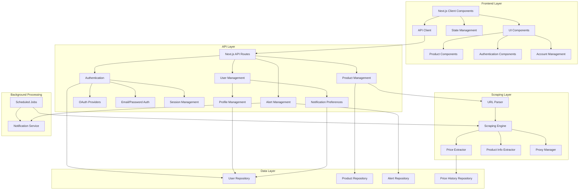

## Key Technical Decisions

### 1. Monolithic First Approach

**Decision**: Start with a monolithic Next.js application rather than microservices.

**Rationale**:
- Faster initial development and deployment
- Simplified debugging and testing
- Reduced operational complexity
- Ability to refactor into microservices later if needed

**Implementation**:
- Next.js for both frontend and API routes
- Shared codebase for all components
- Clear internal module boundaries for future separation

### 2. Authentication and User Management

**Decision**: Implement a flexible authentication system with multiple providers and comprehensive user management.

**Rationale**:
- Support different authentication methods to maximize user adoption
- Provide secure and reliable user authentication
- Enable personalized user experiences
- Support subscription-based access control

**Implementation**:
- NextAuth.js for authentication framework
- Multiple authentication providers:
  - Google OAuth for social login
  - Email/password with secure password hashing
  - Demo account for testing
- User profile management with preferences
- Session-based authentication with secure cookies
- Protected routes with middleware
- Account section in navigation for user-related features
- Password reset functionality with token-based verification
- Forgot password and reset password pages
- Enhanced email verification system with templated emails

### 3. Subscription-Based Monetization

**Decision**: Implement a tiered subscription model using Stripe.

**Rationale**:
- Predictable recurring revenue
- Ability to offer different feature sets at different price points
- Scalable business model
- Industry standard for SaaS applications

**Implementation**:
- Stripe integration for payment processing
- Tiered subscription plans (Free, Basic, Premium, Professional)
- Feature gating based on subscription level
- Subscription management UI for users
- Webhook handling for subscription events
- Email notifications for subscription-related events
- Upgrade prompts for feature limitations
- Context provider for subscription information
- Middleware for enforcing subscription limits

### 4. Real-Time URL-Based Scraping

**Decision**: Implement real-time scraping triggered by user-provided URLs.

**Rationale**:
- Immediate feedback to users
- No need for pre-populated product database
- User-driven product selection
- Flexibility to track any product from supported retailers

**Implementation**:
- URL validation and parsing system
- Retailer detection from URL patterns
- Headless browser (Playwright) for JavaScript-heavy sites
- Direct HTTP requests with HTML parsing for simpler sites
- Price format normalization with MCP price-format server
- Anti-bot protection detection with graceful error handling
- User-friendly error messages for retailer-specific limitations

### 5. Data Storage Strategy

**Decision**: Use a relational database with specialized tables for different entity types.

**Rationale**:
- Strong relationships between entities (users, products, alerts, price history)
- Need for complex queries across related data
- Data integrity requirements
- Predictable schema

**Implementation**:
- PostgreSQL for production use
- Prisma ORM for type-safe database access
- Enhanced database resilience:
  - Connection pooling for optimal performance
  - Retry logic with exponential backoff for transient errors
  - Enhanced Prisma adapter for NextAuth with better error handling
  - Comprehensive error logging for database operations
- Specialized tables for:
  - Users and authentication
  - Products and metadata
  - Price history (time-series data)
  - Alerts and notification preferences
  - Password reset tokens
  - User product settings for markup preferences (added for dropshippers)

### 6. Proxy Management

**Decision**: Implement proxy rotation for scraping operations.

**Rationale**:
- Avoid IP-based rate limiting and blocking
- Distribute requests across multiple sources
- Increase reliability of scraping operations
- Support for higher volume of tracked products

**Implementation**:
- Integration with proxy-management MCP server
- Intelligent proxy selection based on retailer
- Automatic failover for blocked proxies
- Performance tracking for proxy optimization

### 7. Background Processing

**Decision**: Use a combination of node-cron for local scheduling and serverless functions for production.

**Rationale**:
- Cost-effective for variable workloads
- No need to maintain dedicated servers
- Automatic scaling based on number of tracked products
- Simplified deployment and operations
- Flexible scheduling options for different environments

**Implementation**:
- node-cron for local development and testing
- Vercel Cron Jobs for production scheduling
- Prioritization algorithm for checking products
- Batching strategy to optimize resource usage
- Failure handling and retry logic
- Admin interface for monitoring and controlling the scheduled jobs

### 8. Next.js Client-Side Rendering with Suspense Boundaries

**Decision**: Implement proper server/client component architecture with Suspense boundaries for client-side features.

**Rationale**:
- Critical for handling client-side hooks like useSearchParams() properly
- Prevents hydration mismatches between server and client
- Enables proper dynamic content loading patterns
- Follows Next.js App Router best practices

**Implementation**:
- Clear separation between server components (page.tsx) and client components (page-client.tsx)
- Server components handle initial data loading and pass it to client components
- Suspense boundaries around client components that use navigation hooks
- Loading fallbacks displayed during hydration and data fetching
- Dynamic rendering directives (e.g., 'force-dynamic') for proper behavior
- Server-side searchParams passing to avoid client-side hydration issues

### 9. SiteGround-Specific Deployment Strategy

**Decision**: Implement a PHP-based restart solution to work around SiteGround hosting limitations.

**Rationale**:
- SiteGround hosting lacks native Node.js management tools
- SSH access is restricted by firewall rules, preventing direct GitHub Actions access
- Need for a reliable way to restart the Node.js application after deployment
- Requirement to handle deployment without direct server access

**Implementation**:
- Secure token-protected PHP script (restart-app.php) for application restart
- GitHub Actions workflow to deploy both the application and restart script
- Two-phase deployment approach:
  1. FTP deployment of application files and PHP script
  2. Post-deployment restart triggered via HTTP request to the PHP script
- Detailed documentation of the restart solution
- Token-based security to prevent unauthorized restarts

## Data Flow Patterns

### User Registration and Authentication

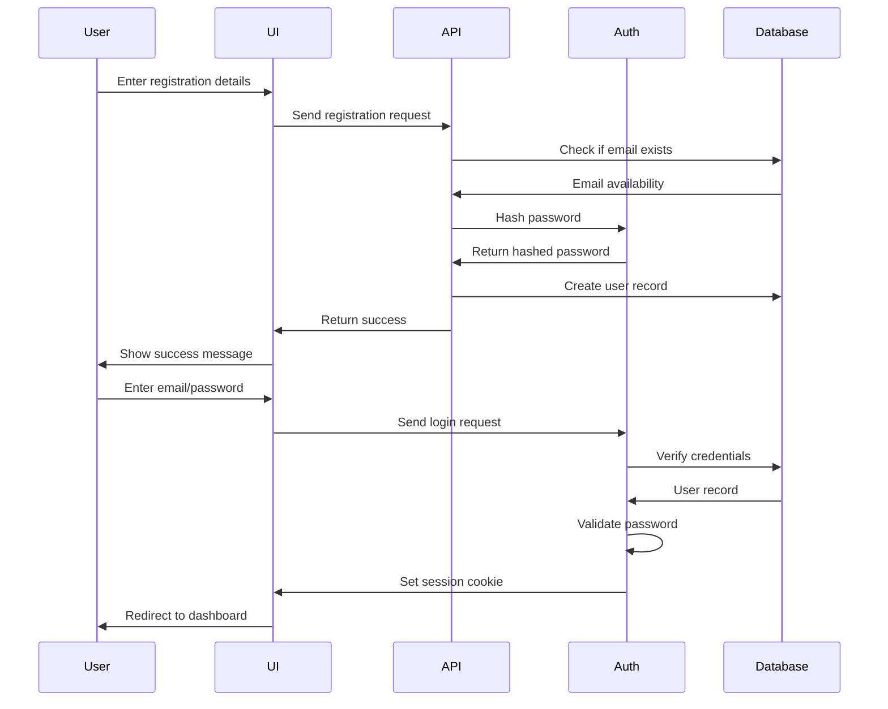

### Adding a Product

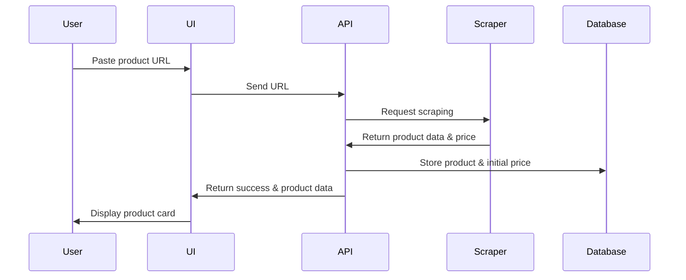

### Price Check Process

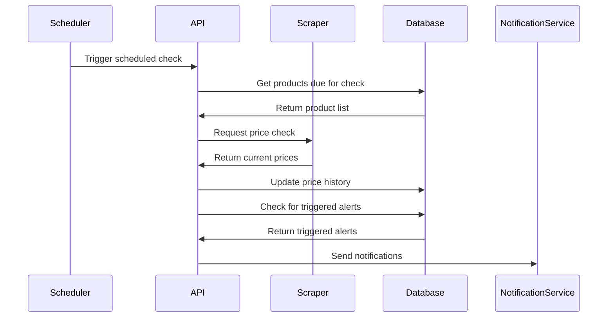

### Subscription Process

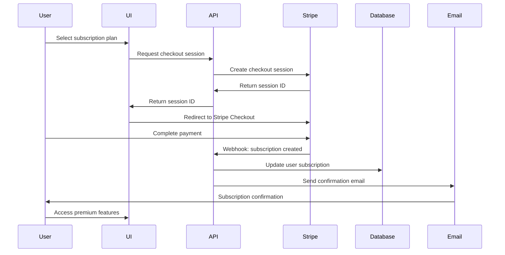

### Email Verification Process

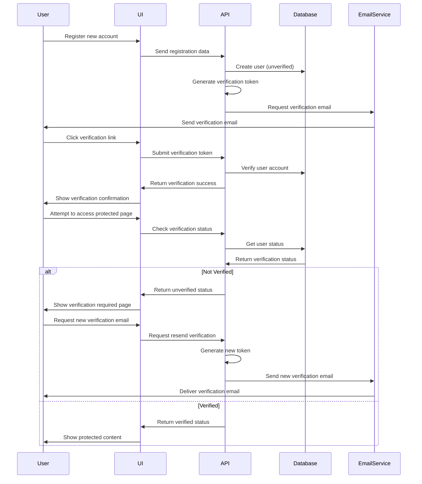

### Password Reset Process

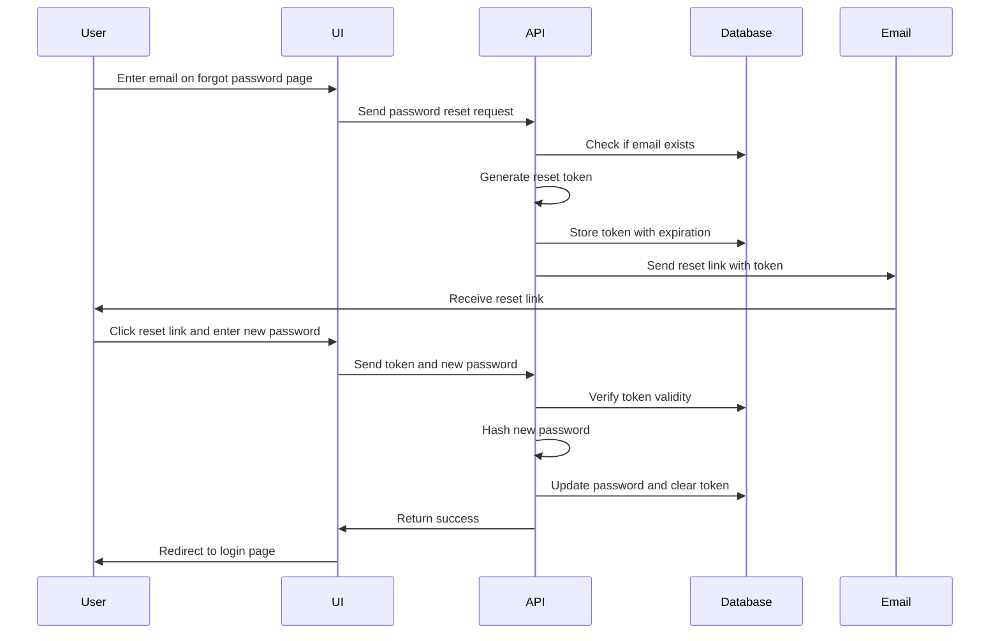

### Dropshipper Markup Configuration

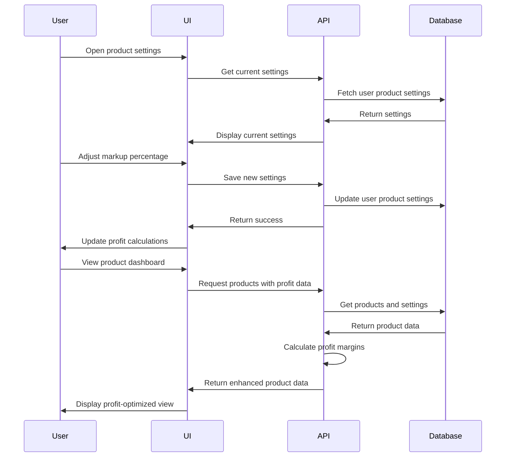

### SiteGround Deployment and PHP Restart Process

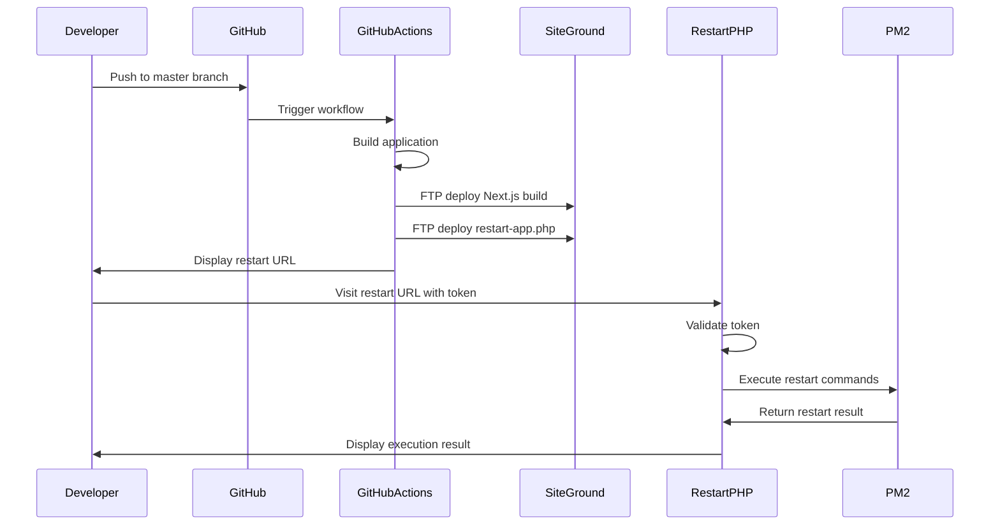

## React Component Patterns

### React Hooks Best Practices

To ensure consistent behavior and prevent "Cannot update a component while rendering a different component" errors, we follow these patterns:

1. **Hook Order Consistency**
   - All hooks must be called unconditionally at the top level of components
   - No hooks inside conditionals, loops, or nested functions
   - Maintain the same hooks order on every render
   - Move conditional logic inside hooks, not around them

2. **Navigation Pattern**
   ```jsx
   // ✅ CORRECT: Navigation in useEffect with state management
   const [isRedirecting, setIsRedirecting] = useState(false);
   
   useEffect(() => {
     if (condition && !isRedirecting) {
       setIsRedirecting(true);
       try {
         router.replace('/destination');
       } catch (error) {
         setIsRedirecting(false);
         console.error('Navigation error:', error);
       }
     }
   }, [condition, router, isRedirecting]);
   
   // ❌ INCORRECT: Navigation during render
   if (condition) {
     router.replace('/destination'); // This will cause errors
     return <LoadingSpinner />;
   }
   ```

3. **Authentication Flow**
   - Use `useSession({ required: true })` for automatic redirects
   - Maintain a clear loading state during authentication checks
   - Handle all auth states (loading, authenticated, unauthenticated)
   - Prevent redirect loops with careful state tracking

4. **Loading State Pattern**
   - Define loading UI components once and reuse them
   - Use consistent loading indicators across the application
   - Ensure loading states don't trigger unnecessary renders

5. **Suspense Boundary Pattern**
   ```jsx
   // ✅ CORRECT: Server component with Suspense boundary
   // page.tsx (Server Component)
   export default function Page({ searchParams }) {
     return (
       <Suspense fallback={<LoadingComponent />}>
         <ClientComponent initialSearchParams={searchParams} />
       </Suspense>
     );
   }
   
   // page-client.tsx (Client Component)
   "use client";
   
   export default function ClientComponent({ initialSearchParams }) {
     // Safe to use client-side hooks here
     const searchParams = useSearchParams();
     const router = useRouter();
     
     // Component logic...
   }
   ```

## Error Handling Patterns

1. **Authentication Failures**
   - Structured error responses with clear messages
   - Rate limiting for login attempts
   - Secure password reset flow
   - Graceful handling of expired sessions
   - Redirect to login with return URL preservation
   - Multi-layered client-side resilience:
     - JWT wrapper to prevent null payload errors
     - Session error boundary to intercept auth API failures
     - SafeAuthProvider for graceful authentication degradation
     - Fallback session states when authentication fails

2. **Scraping Failures**
   - Retry with exponential backoff
   - Attempt with alternative proxies
   - Fall back to simplified extraction methods
   - Record failure reason for analysis
   - Maintain last known good price until resolution

3. **API Errors**
   - Structured error responses with codes and messages
   - Client-side retry for transient errors
   - Graceful degradation of UI
   - Error logging and monitoring
   - User-friendly error messages

4. **Database Failures**
   - Connection pooling and retry logic
   - Transactions for data integrity
   - Fallback to cached data when appropriate
   - Monitoring and alerting for persistent issues

5. **Deployment Failures**
   - Clear error reporting during deployment
   - Verification steps to prevent partial deployments
   - Recovery options after failed deployment
   - Pre-deployment backups for rollback capability
   - Post-deployment health checks

## Recent Implementation Improvements

### SiteGround Deployment Solution (Mar 14, 2025)

1. **PHP-based Restart Solution**
   - Created a secure token-protected PHP script for application restart
   - Token authentication prevents unauthorized restarts
   - Script executes server-side commands to restart PM2 process
   - Modified GitHub Actions workflow to deploy the PHP script to the correct location

2. **Deployment Process Enhancement**
   - Updated GitHub Actions workflow for two-phase deployment:
     1. FTP deployment of application files to SiteGround
     2. FTP deployment of restart script to proper location
   - Fixed deployment path configuration for proper file placement
   - Detailed documentation for the restart solution in docs/remote-restart-solution.md

3. **SiteGround Hosting Adaptation**
   - Identified and documented SiteGround hosting limitations:
     - No specialized Node.js management tools in their control panel
     - Limited SSH access capabilities due to firewall restrictions
     - Need for manual restart triggers after FTP deployment
   - Implemented workarounds for these limitations with the PHP restart solution
   - Created reliable patterns for production deployment in this environment

### Next.js Client-Side Rendering Fixes (Mar 13, 2025)

We have successfully addressed Client-Side Rendering issues in the Next.js application:

1. **Server/Client Component Pattern**
   - Implemented proper separation between server components and client components
   - Created pattern with server component (page.tsx) wrapping client component (*-client.tsx)
   - Added Suspense boundaries around client components that use navigation hooks
   - Passed searchParams from server to client to avoid hydration mismatches
   - Added proper loading fallbacks for improved user experience

2. **Affected Pages**
   - Fixed /settings page with proper client component architecture
   - Implemented proper Suspense boundary for /profile page
   - Updated /products page with server/client separation
   - Enhanced /scraper-test with client-side rendering improvements
   - Structured all remaining pages with consistent patterns

3. **Build Improvements**
   - Fixed critical build errors that were previously blocking deployment
   - Improved TypeScript type declarations for cleaner development experience
   - Optimized bundle sizes by properly splitting server and client code
   - Enhanced overall application stability and reliability

### Dropshipper Dashboard Implementation (Mar 12, 2025)

1. **Markup Settings System**
   - Added UserProductSettings model for storing user-specific markup preferences
   - Implemented API endpoints for managing markup settings
   - Created UI for configuring markup percentages per product
   - Added automatic profit calculations based on user settings

2. **Profit-Focused UI**
   - Enhanced product cards with ROI indicators and profit metrics
   - Added visual indicators for price trends to aid buying decisions
   - Implemented dashboard views optimized for dropshippers
   - Created comprehensive profit analytics and visualizations

### Authentication System

We have successfully addressed the authentication system issues:

1. **NextAuth.js Beta Compatibility**
   - Simplified the auth.ts configuration to resolve TypeScript errors
   - Added @ts-nocheck to bypass TypeScript errors with NextAuth.js beta
   - Implemented a custom credentials provider to handle email/password authentication

2. **Session Management**
   - Fixed session handling in API routes
   - Resolved "Add Item to Dashboard" functionality by properly handling authentication
   - Fixed unauthorized errors when accessing subscription status API

3. **Missing Pages**
   - Implemented dedicated Products page for managing tracked products
   - Created Alerts page for managing price alerts
   - Updated navigation to properly link to these pages

4. **Password Reset Functionality**
   - Added resetToken and resetTokenExpires fields to the User model
   - Created a reset-password API endpoint for initiating and completing password resets
   - Enhanced the EmailService class with a sendEmail method for custom emails
   - Implemented forgot-password and reset-password pages
   - Added "Forgot password?" link to the sign-in page

### UI Integration

1. **Products Page**
   - Implemented a comprehensive Products page that displays all tracked products
   - Added functionality to refresh prices in real-time
   - Implemented product deletion
   - Added loading states and error handling

2. **Alerts Page**
   - Created a full-featured Alerts page with filtering by status
   - Implemented alert editing, deletion, and reset functionality
   - Displayed product information alongside alerts

3. **Add to Dashboard**
   - Fixed the "Add Item to Dashboard" functionality in the scraper-test page
   - Ensured products are properly saved to the database
   - Improved error handling with more specific error messages

### Recent Enhancements

1. **Email Service Improvements**
   - Added a dedicated sendVerificationEmail method for consistent email verification
   - Enhanced email templates with better styling and clearer instructions
   - Centralized email sending logic for better maintainability
   - Improved error handling for email delivery failures

2. **UI Navigation Consistency**
   - Added home buttons across all pages for easier navigation
   - Fixed redirect issues between pages
   - Ensured consistent navigation patterns across the application
   - Improved mobile responsiveness for all pages

3. **Dashboard Statistics**
   - Replaced hardcoded placeholder statistics with real-time data
   - Implemented data fetching for active alerts, products, and price drops
   - Created more meaningful descriptions for statistics when no data exists
   - Improved visual representation of statistics

4. **System Resilience**
   - Enhanced error handling throughout the application
   - Improved form validation and error messages
   - Added fallback UI states for loading and error conditions
   - Implemented better handling of network failures

## Production Architecture

PriceHawk's production architecture is now fully implemented and addresses all aspects of scalability, reliability, security, and performance:

```mermaid
graph TD
    A[Production Architecture] --> B[Core Application]
    A --> C[Infrastructure]
    A --> D[Security Layer]
    A --> E[Monitoring & Observability]
    A --> F[Deployment Pipeline]
    
    B --> B1[Next.js Frontend]
    B --> B2[API Layer]
    B --> B3[Data Access Layer]
    B --> B4[Background Processing]
    
    C --> C1[PostgreSQL Database]
    C --> C2[SiteGround Hosting]
    C --> C3[Stripe Integration]
    C --> C4[SendGrid Email]
    C --> C5[PM2 Process Manager]
    
    D --> D1[Authentication]
    D --> D2[Rate Limiting]
    D --> D3[CSRF Protection]
    D --> D4[Data Encryption]
    
    E --> E1[Health Checks]
    E --> E2[Performance Metrics]
    E --> E3[Error Logging]
    E --> E4[Status Monitoring]
    
    F --> F1[GitHub Actions]
    F --> F2[Pre-Deployment Checks]
    F --> F3[Database Backups]
    F --> F4[Automated Deployment]
    F --> F5[PHP Restart Script]
```

### Rate Limiting Architecture

The rate limiting system was implemented with a tiered approach that scales with subscription levels:

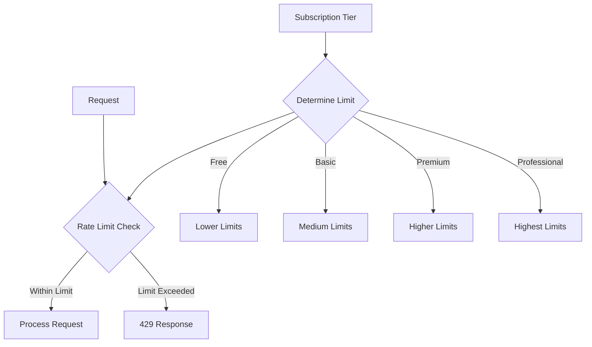

1. **Tiered Rate Limiting**
   - Authentication routes: 100 attempts per hour
   - API routes: Scaled by subscription (300-5000 requests per hour)
   - Scraping operations: Scaled by subscription (5-120 scrapes per hour)

2. **Implementation**
   - In-memory rate limiting store with IP and identifier tracking
   - Configurable rate windows and limits
   - Specialized middleware for different types of routes

### Health Monitoring System

A comprehensive health monitoring system has been implemented:

```mermaid
graph TD
    A[/api/health Endpoint] --> B{Check Database}
    B -->|Connected| C[Database Healthy]
    B -->|Error| D[Database Unhealthy]
    
    A --> E{Check Environment}
    E -->|Valid| F[Environment Healthy]
    E -->|Invalid| G[Environment Unhealthy]
    
    C --> H{Overall Status}
    F --> H
    D --> H
    G --> H
    
    H -->|All Healthy| I[200 Response]
    H -->|Any Unhealthy| J[503 Response]
```

1. **Health Check Endpoint**
   - GET /api/health for detailed health information
   - HEAD /api/health for lightweight monitoring
   - Database connectivity verification
   - Environment validation
   - Response time measurement

2. **Monitoring Integration**
   - Standard response format for integration with monitoring tools
   - Clear status indicators for automated checking
   - Performance metrics for trending analysis

### Deployment Pipeline

The CI/CD pipeline is now fully implemented with GitHub Actions:

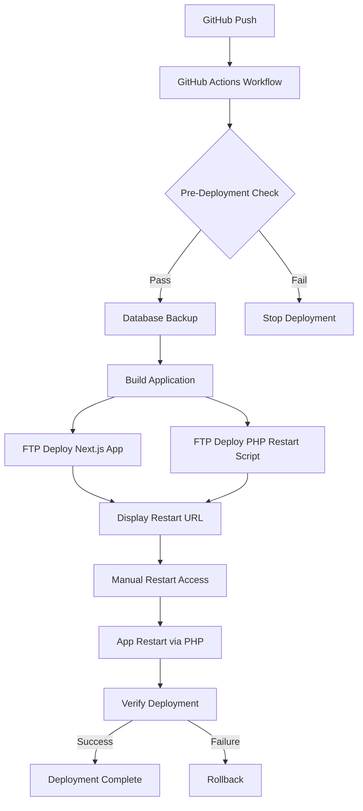

1. **Automatic Deployment**
   - Triggered by pushes to main branch
   - Pre-deployment verification of requirements
   - Automated database backup before deployment
   - Build and deploy to SiteGround via FTP
   - Deploy PHP restart script to server
   - Post-deployment restart via PHP script
   - Post-deployment verification

2. **SiteGround-Specific Restart Solution**
   - Token-protected PHP script for secure restart
   - GitHub Actions workflow displays restart URL
   - Manual browser access to restart script
   - Script executes PM2 restart commands
   - Detailed output for verification

3. **Rollback Capability**
   - Pre-deployment database backups
   - Version tracking for backups
   - Clear rollback procedures

### Database Management

The database management system has been enhanced for production:

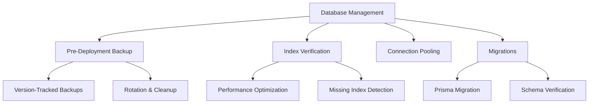

1. **Backup System**
   - Specialized pre-deployment backups
   - Version tracking for rollbacks
   - Automated rotation of old backups
   - Comprehensive restore procedures

2. **Performance Optimization**
   - Index verification script
   - Connection pooling configuration
   - Query optimization guidelines
   - Transaction handling for critical operations

### Security Architecture

The security architecture has been hardened for production:

1. **Authentication Security**
   - Rate limiting to prevent brute force attacks
   - Token-based authentication with secure storage
   - Session validation and renewal
   - Secure password reset flow

2. **Data Protection**
   - CSRF protection for all state-changing operations
   - Input validation and sanitization
   - Security headers on all API responses
   - Secure cookie configuration

3. **Error Handling**
   - Production-safe error messages
   - Detailed internal logging without information leakage
   - Standardized error response format
   - Error tracking with request IDs

4. **Deployment Security**
   - Token-protected PHP restart script
   - Secure GitHub secrets management
   - Clear authentication for system-level operations
   - Restricted access to sensitive operations

## Scalability Implementation

The scalability features have been fully implemented:

1. **Database Optimization**
   - Connection pooling for improved performance
   - Strategic indexes for common query patterns
   - Optimized queries with proper joins and filters
   - Efficient transaction handling

2. **API Performance**
   - Pagination for large result sets
   - Cache control headers for client-side caching
   - Optimized response formats
   - Security with minimal performance impact

3. **Resource Management**
   - Subscription-based rate limiting
   - Efficient background job scheduling
   - Optimized scraping with proxy management
   - PM2 process management for reliability
